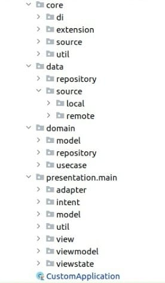
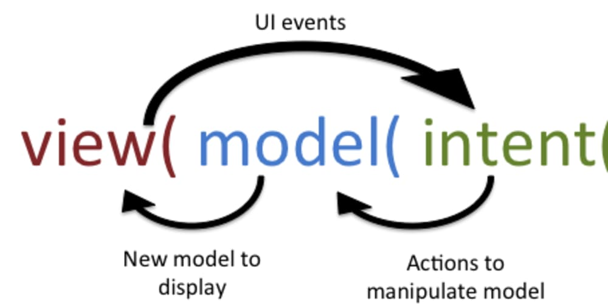

# Android - kotlin - Coroutines - MVI - Clean Architectural - Koin - Unit Test - UI Test
 
It's a sample project that created by the latest Android technologies and frameworks to be a reference/base for everyone want to start his own project/app much faster.

Brief :  sample app consist of one screens:-
-  Main Screen.

![alt text] 

# Technologies and Frameworks : 
 
## Programming language
### Kotlin

Kotlin is an open source programming language for the Java Virtual Machine (JVM). therefore, be used anywhere Java is used today (which is virtually anywhere). This includes server, client, web, and Android development. It’s a light powerful programming languagne. 

https://business.udemy.com/blog/kotlin-vs-java-9-benefits-of-kotlin-for-your-business/

# Design Patterns & Code structure

- ### Clean code Archtiecture

Clean architecture is a software design paradigm that separates the elements of a design into layers. The main rule of clean architecture is that code dependencies can only come from the outer levels inward. Code on the inner layers can have no knowledge of functions on the outer layers. As below we can see the 

- Entities: These are the business objects of the application.
- Use Cases: These use cases orchestrate the flow of data to and from the entities. Are also called Interactors.
- Interface Adapters: This set of adapters convert data from the format most convenient for the use cases and entities. - Presenters and Controllers belong here.
- Frameworks and Drivers: This is where all the details go: UI, tools, frameworks, etc.

- ### MVI
MVI stands for Model-View-Intent. MVI is one of the newest architecture patterns for Android, inspired by the unidirectional and cyclical nature of the Cycle.js framework.

- 1- Model represents a state. Models in MVI should be immutable to ensure a unidirectional data flow between them and the other layers in your architecture.

- 2- Like in MVP, Interfaces in MVI represent Views, which are then implemented in one or more Activities or Fragments.

- 3- Intent represents an intention or a desire to perform an action, either by the user or the app itself. For every action, a View receives an Intent. The Presenter observes the Intent, and Models translate it into a new state.

![alt text] 

## Dependency Injection
### Koin
Is the powerful lightweight dependency injection framework. Written in pure Kotlin using functional resolution. You create you dependenies graph by yourself . So , you will be aware of all generated code under the hood. You can write more about it here. https://insert-koin.io/  

## Backgrounds & async Events
### Coroutines
#### Coroutines = Co + Routines
Coroutines is A framework to manage concurrency(threads) in a more performant and simple way with its lightweight thread which is written on top of the actual threading framework to get the most out of it by taking the advantage of cooperative nature of functions. 

To read more about Coroutines. I strognally recommend this artical <a href="https://blog.mindorks.com/mastering-kotlin-coroutines-in-android-step-by-step-guide">Link</a>

## Unit Test
### JUnit, Mockito, Espresso

The unit test is one of the fundamental parts of the development life cycle. Writing Unit test lets you found and expect uncovered scenarios which we are not thinking about it during development. therefore, you going to cover it and save your clients from face unexpected behavior.

For Android , There'r two types of Testing :- 

-  Local Test: Unit tests that compile and run locally on JVM. So, no need to a real device Also, it's not depend on the Android Framework classes. If your tests depend on objects in the Android framework,you have to use Robolectric.

- Instrumented tests: Unit tests that run on an Android device or emulator.